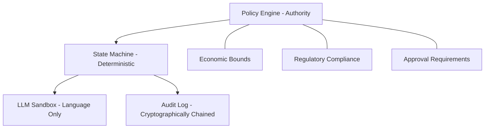

# Medical Supplies Procurement Negotiation Agent
## Reference Implementation

[](https://opensource.org/licenses/MIT)

A deterministic negotiation execution system designed for regulated healthcare environments.

> [!IMPORTANT]
> This is a reference implementation illustrating architectural principles. It intentionally excludes production policy logic, cryptographic material, and regulatory configurations. 

> [!NOTE]
> This repository demonstrates execution guarantees, not procurement strategy.

---

## Intended Audiences

This repository is structured to serve multiple stakeholders:

- **Procurement & Compliance Leaders**
  - Understand system guarantees, auditability, and dispute resolution.
  - See `SYSTEM_PROMISE`, invariants, and audit replay semantics.
- **Security & Platform Engineers**
  - Review state machine determinism, WAL durability, and idempotency.
  - Inspect property-based tests and threat model.
- **Auditors & Regulators**
  - Verify non-repudiation, immutable logs, and approval governance.
  - Review formal invariants and replay reconstruction.
- **Researchers / Architects**
  - Study how formal methods bind to runtime enforcement.

---

> **New to formal methods or audit-grade systems?**  
> Start with the [Glossary](docs/GLOSSARY.md) before reading the code.

---

## What This System Does

Executes vendor negotiations through a **deterministic state machine** with:

- **Formal safety invariants** (TLA+ derived, runtime enforced)
- **Cryptographic audit trails** (hash-chained, tamper-evident)
- **Human-in-the-loop approval** (no autonomous purchasing)
- **Policy-governed execution** (LLMs sandboxed for language only)

**Primary Use Case**: Making procurement negotiations **provably compliant**, **replayable**, and **non-repudiable** under dispute or audit.

---

## Why This Matters

Most healthcare procurement disputes happen because negotiations leave no defensible record:

- Email threads
- Phone calls  
- Spreadsheets

When a vendor disputes final terms, there's no cryptographic proof of what was agreed.

**This system solves that.**

Every offer, counter-offer, and acceptance is:
- Cryptographically signed
- Immutably logged
- Hash-chained for tamper evidence

**Result**: Disputes are resolved with evidence, not arguments.

---

## Explicit Non-Goals

This system is intentionally NOT designed to:

- Autonomously select vendors
- Optimize pricing beyond human-defined bounds
- Replace procurement authority
- Bypass institutional approvals
- Act without auditability

Any system claiming these capabilities in regulated healthcare should be treated as high risk.

---

## Failure Behavior Summary

| Scenario | System Behavior |
|----------|-----------------|
| Vendor disputes terms | Cryptographic audit log proves final agreement |
| LLM proposes invalid terms | Proposal rejected, no state transition |
| Approval service unavailable | Negotiation blocked unless governed override |
| System crash mid-negotiation | WAL replay restores exact state |
| Replay attack attempted | Duplicate transition rejected |

---

## Compliance Alignment (Illustrative)

| Requirement | Mechanism |
|-------------|-----------|
| Non-repudiation | Signed, hash-chained audit log |
| Change control | Policy version pinning |
| Separation of duties | Human approval + override governance |
| Audit replay | Dual execution modes |

---

## Architecture Overview



---

## Key Features

### 1. Formal Safety Invariants

Derived from TLA+ specification and enforced at runtime:

- **INV_S1**: No unauthorized commits (requires approval or emergency override)
- **INV_S2**: Monotonic concessions only (no reversal)
- **INV_S3**: Terminal state absorption (COMMIT/ABORT are final)

See [INVARIANTS.md](docs/INVARIANTS.md) for details.

### 2. Deterministic State Machine

No hidden transitions. No implicit behavior.

```
INIT → CAPABILITY_DISCOVERY → ANCHOR_PROPOSED → NEGOTIATING 
     → AGREEMENT_DRAFT → HUMAN_APPROVAL → COMMIT
```

See [engine/state_machine.py](engine/state_machine.py) for implementation.

### 3. Cryptographic Auditability

Every state transition is logged with:
- Previous event hash
- Current event hash
- Timestamp
- Transition reason

See [examples/sample_audit_log.json](examples/sample_audit_log.json) for format.

### 4. Property-Based Testing

Uses Hypothesis to fuzz state transitions and verify invariants hold under all conditions.

See [tests/test_invariants.py](tests/test_invariants.py) for examples.

---

## Documentation

- [GLOSSARY.md](docs/GLOSSARY.md) - Core terminology
- [ARCHITECTURE.md](docs/ARCHITECTURE.md) - System design and component interaction
- [THREAT_MODEL.md](docs/THREAT_MODEL.md) - Security considerations and mitigations
- [INVARIANTS.md](docs/INVARIANTS.md) - Formal safety properties
- [RUNTIME_VS_AUDIT_REPLAY.md](docs/RUNTIME_VS_AUDIT_REPLAY.md) - Execution mode semantics

---

## Running the Simulation

```bash
# Install dependencies
pip install -r requirements.txt

# Run deterministic demonstration simulation
python simulate.py
```

**Note**: The simulation uses synthetic policies, vendors, and prices. It demonstrates flow, not production functionality.

---

## What's NOT Included

This public repository **intentionally excludes**:

- Production policy schemas
- Economic bounds and reservation logic
- Vendor behavior heuristics
- Approval logic thresholds
- Real cryptographic implementations
- UCP adapter details
- Emergency override execution paths
- Production persistence backends

These are commercial assets and remain private.

---

## Technical Highlights

- **Exactly-Once Semantics**: Idempotent transitions prevent duplicate commits
- **Time-Bound Approvals**: Tokens expire and bind to exact terms
- **Dual-Mode Execution**: Runtime vs audit replay with different validation rules
- **Clock Trust Model**: NTP synchronization with drift detection

---

## Contact

**Author**: Nik. Kontopoulos  
**Email**: sv1eex@hotmail.com  
**GitHub**: https://github.com/z1000biker/pharmanegotiation

Open to conversations with procurement, compliance, and platform leaders in regulated healthcare environments.

---

## License

MIT License - See [LICENSE](LICENSE) for details.

---

## Disclaimer

This repository is a reference implementation illustrating architectural principles for deterministic negotiation execution in regulated environments. It intentionally excludes production policy logic, cryptographic material, and regulatory configurations. Use at your own risk.
