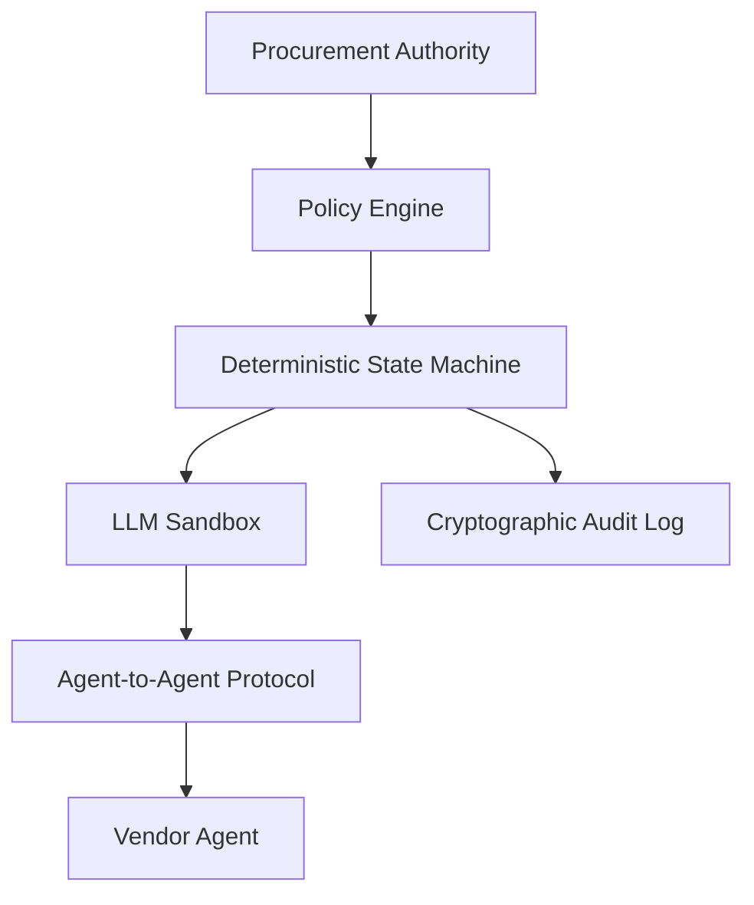

# System Architecture

## Overview

The Medical Supplies Procurement Negotiation Agent is a deterministic execution system designed to move negotiations from human-led, fragmented communications (email/calls) to policy-governed, cryptographically signed machine execution.

## Component Block Diagram

## Core Components

### 1. Policy Engine (Authority)
The source of truth for all negotiation constraints. It defines unit price bounds, volume requirements, and regulatory compliance checks. It is **non-LLM based** and uses hard-fail semantics.

### 2. State Machine (Execution)
A rigid Finite State Machine (FSM) that governs the lifecycle of a negotiation. It ensures that transitions are valid, terminal states are absorbing, and no state can be bypassed.

### 3. LLM Sandbox (Language Generation)
Large Language Models are used strictly for phrasing and generating natural language offers. The sandbox ensures the LLM has **zero authority**:
- It cannot approve a deal.
- It cannot exceed economic bounds.
- It cannot modify the state machine.

### 4. Cryptographic Audit Log (WAL)
Every state transition is recorded in a Write-Ahead Log (WAL). Each entry contains:
- Previous hash (forming a Merklized chain)
- Current payload hash
- Cryptographic signature of the sender
- Detailed transition reason

## Security Principles

- **No Implicit Authority**: Authority must be explicitly stated in the policy or provided via an approval token.
- **Deterministic Reproducibility**: Given an audit log, the final state can be perfectly reconstructed.
- **Byzantine Resilience (Conceptual)**: The system assumes agents (both internal and external) may behave hostiley and enforces invariants to prevent loss.

## Deployment Topology

The system is designed to run as a single-tenant or multi-tenant microservice, typically deployed alongside:
- **Approval Gateway**: For human-in-the-loop sign-offs.
- **Persistence Provider**: Storage for audit logs and negotiation state.
- **UCP Adapter**: For execution of agreed-upon terms into ERP/ordering systems.

---

**Author**: Nik. Kontopoulos  
**Status**: Reference Implementation v1.0
